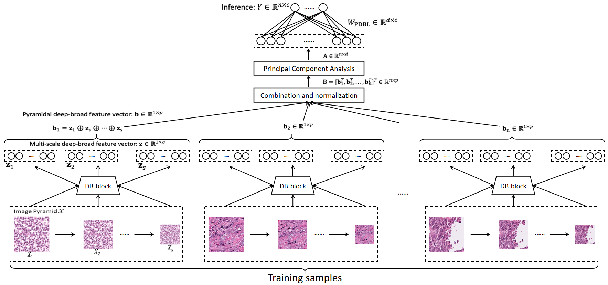

# PDBL: Improving Histopathological Tissue Classification with Plug-and-Play Pyramidal Deep-Broad Learning


## Introduction
The code of:

**PDBL: Improving Histopathological Tissue Classification with Plug-and-Play Pyramidal Deep-Broad Learning**, Jiatai Lin, Guoqiang Han, Xipeng Pan, Zaiyi Liu, Hao Chen, Danyi Li, Xiping Jia, Zhenwei Shi, Zhizhen Wang, Yanfen Cui, Haiming Li, Changhong Liang, Li Liang, Ying Wang, Chu Han, in IEEE Transactions on Medical Imaging, doi: 10.1109/TMI.2022.3161787.[[paper]](https://ieeexplore.ieee.org/document/9740140)

You can also download the repository from https://github.com/linjiatai/PDBL.

## Abtract
Histopathological tissue classification is a simpler way to achieve semantic segmentation for the whole slide images, which can alleviate the requirement of pixel-level dense annotations. Existing works mostly leverage the popular CNN classification backbones in computer vision to achieve histopathological tissue classification. In this paper, we propose a super lightweight plug-and-play module, named Pyramidal Deep-Broad Learning (PDBL), for any well-trained classification backbone to improve the classification performance without a re-training burden. For each patch, we construct a multi-resolution image pyramid to obtain the pyramidal contextual information. For each level in the pyramid, we extract the multi-scale deep-broad features by our proposed Deep-Broad block (DB-block). We equip PDBL in three popular classification backbones, ShuffLeNetV2, EfficientNetb0, and ResNet50 to evaluate the effectiveness and efficiency of our proposed module on two datasets (Kather Multiclass Dataset and the LC25000 Dataset). Experimental results demonstrate the proposed PDBL can steadily improve the tissue-level classification performance for any CNN backbones, especially for the lightweight models when given a small among of training samples (less than 10%). It greatly saves the computational resources and annotation efforts.

## Requirements
- CUDA
- 1×GPU
- 2×CPU
- Python 3.7
- numpy==1.21.5
- pytorch==1.11.0
- torchvision==0.12.0
- scikit-learn==0.24.2
## Usage
### Installation
- Download the repository.
```
git clone https://github.com/linjiatai/PDBL.git
```
- Install python dependencies.
```
pip install -r requirements.txt
```

### PDBL
- We provide an example to train a PDBL on 1% KMI set without re-training burden of CNN backbone. You can download the 1% KMI set ([Google Drive](www.baidu.com) or [Baidu Netdisk](www.baidu.com)) and KME ([Google Drive](www.baidu.com) or [Baidu Netdisk](www.baidu.com)) set and unpacked them in **datset** folder. And you can train and test the PDBL by the command:

```
python main.py --device 0 --save_dir save/ --traindir dataset/KMI_001/ --valdir dataset/KME --batch_size 20 -- n_class --n_workers 8
```

## Citation
If you find the code useful, please consider citing our paper using the following BibTeX entry.
```
@ARTICLE{9740140,
  author={Lin, Jiatai and Han, Guoqiang and Pan, Xipeng and Liu, Zaiyi and Chen, Hao and Li, Danyi and Jia, Xiping and Shi, Zhenwei and Wang, Zhizhen and Cui, Yanfen and Li, Haiming and Liang, Changhong and Liang, Li and Wang, Ying and Han, Chu},
  journal={IEEE Transactions on Medical Imaging}, 
  title={PDBL: Improving Histopathological Tissue Classification with Plug-and-Play Pyramidal Deep-Broad Learning}, 
  year={2022},
  pages={1-1},
  doi={10.1109/TMI.2022.3161787}}
```


